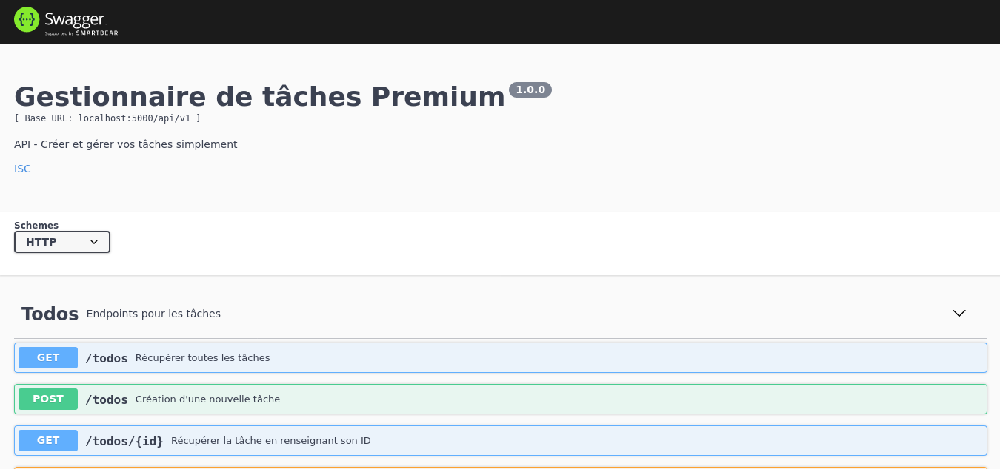

# API-Todo
   

Task management API - NodeJS

## Documentation - Swagger

Go to [http://localhost:5000/api-docs](http://localhost:5000/api-docs)

## Installation

1. You need `Node.js` **(at least 12.x version)** installed on your machine, if you don't have it, you should install it - download [link](https://nodejs.org/en/download/)

2. [Clone the project from github](https://github.com/jiben22/API-Todo) or [download the archive](https://github.com/jiben22/API-Todo)

   `git clone https://github.com/jiben22/API-Todo`

3. `cd` to your downloaded Task management API

4. Install necessary dependencies:

   - **Via node `npm` package manager** - Run `npm install` on the project root

## How to run

`npm run start`